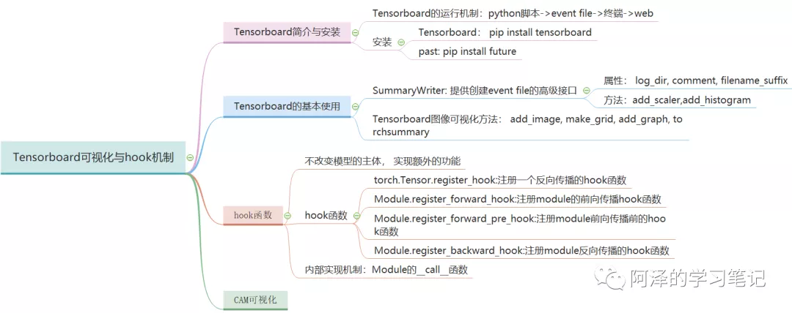
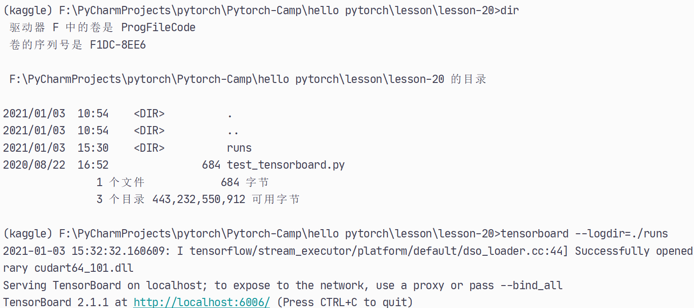
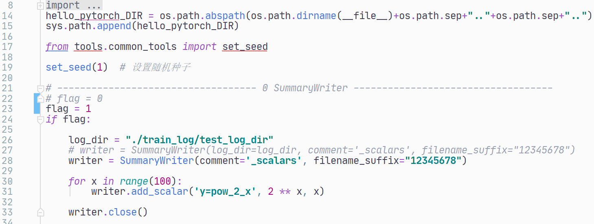
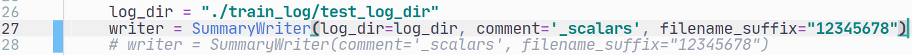
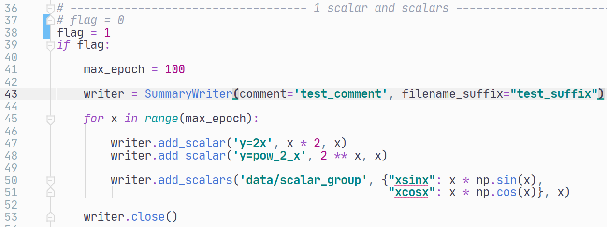
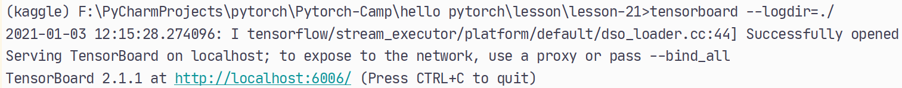
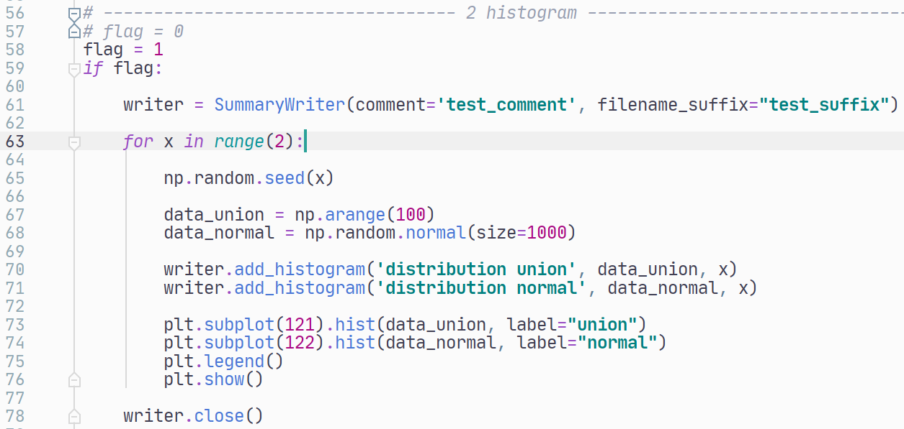
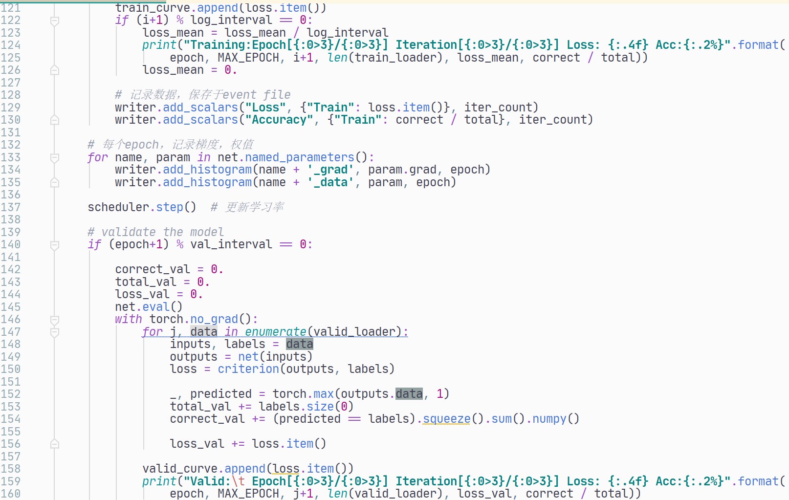

Week5【任务1】第二节：TensorBoard简介与安装




```python
import numpy as np
from torch.utils.tensorboard import SummaryWriter


writer = SummaryWriter(comment='test_tensorboard')

for x in range(100):

    writer.add_scalar('y=2x', x * 2, x)
    writer.add_scalar('y=pow(2, x)',  2 ** x, x)
    
    writer.add_scalars('data/scalar_group', {"xsinx": x * np.sin(x),
                                             "xcosx": x * np.cos(x),
                                             "arctanx": np.arctan(x)}, x)
writer.close()
```




#### 安装注意事项
pip install tensorboard的时候会报错︰
ModuleNotFoundError: No module named 'past'
通过pip install future解决

#### TensorBoard

**SummaryWriter**
功能:提供创建event file的高级接口
主要属性:
log dir: event file输出文件夹
comment: 不指定log_dir时，文件夹后缀
filename suffix: event file文件名后缀

```python
class SummaryWriter(object):
def __init __(self, log_dir=None, comment='', purge_step=None, max_queue = 10, flush_secs=120, filename_suffix='')
```

#### 0 SummaryWriter




设置log_dir，comment不起作用




**1. add_scalar()**
功能:记录标量
tag: 图像的标签名,图的唯一标识
scalar_value: 要记录的标量
global_step: x轴

**2. add_scalars()**
main_tag: 该图的标签
tag_scalar_dict : key是变量的tag, value是变量的值

```python
add_scalar(tag, scalar_value, global_step=None, walltime=None)
add_scalars(main_tag, tag_scalar_dict, global_step=None, walltime=None)
```







**3. add_histogram()**

功能:统计直方图与多分位数折线图
tag: 图像的标签名，图的唯一标识
values: 要统计的参数
global_step: y轴
bins: 取直方图的bins

```python
add_histogram(tag, values, global_step=None, bins='tensorflow', walltime=None)
```

**2. histogram **




#### example





#### acc & loss


#### histogram


#### fc3.weight_data


